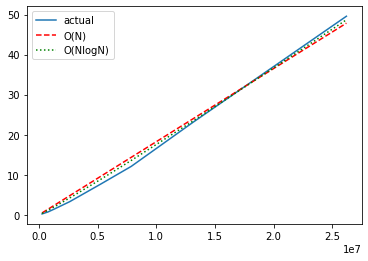

| Sort Type | Size (MB) | Time (s) |
|:----------|:---------:|:--------:|
| In memory | 1 | 0.23 |
| In memory | 3 | 0.74 | 
| In memory | 5 | 1.45 |
| In memory | 10 | 3.29 |
| In memory | 20 | 7.64 |
| In memory | 30 | 12.09 |
| In memory | 50 | 23.04 |
| In memory | 100 | 49.57 |
| File | 50 | 25.18 |
| File | 100 | 50.08 |
| File | 250 | 130.16 |
| File | 500 | 267.89 |

In memory tree sort. Can observe that NlogN better approximates actual 
results then N. Thus empirical asymptotic matches theoretical O(N*logN) for random arrays.

For sort with files the theoretical asymptotic is 
O(N * log(batchSize) + N * log(N / batchSize)) = O(N * log(N)). We also have NlogN approximation
closer to the empirical results than N approximation that proves theoretical results.

